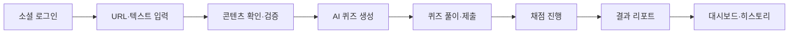
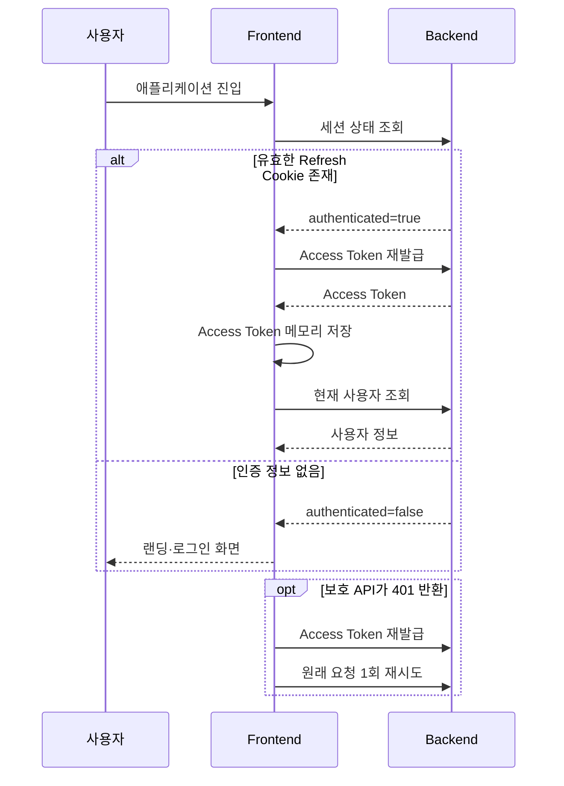
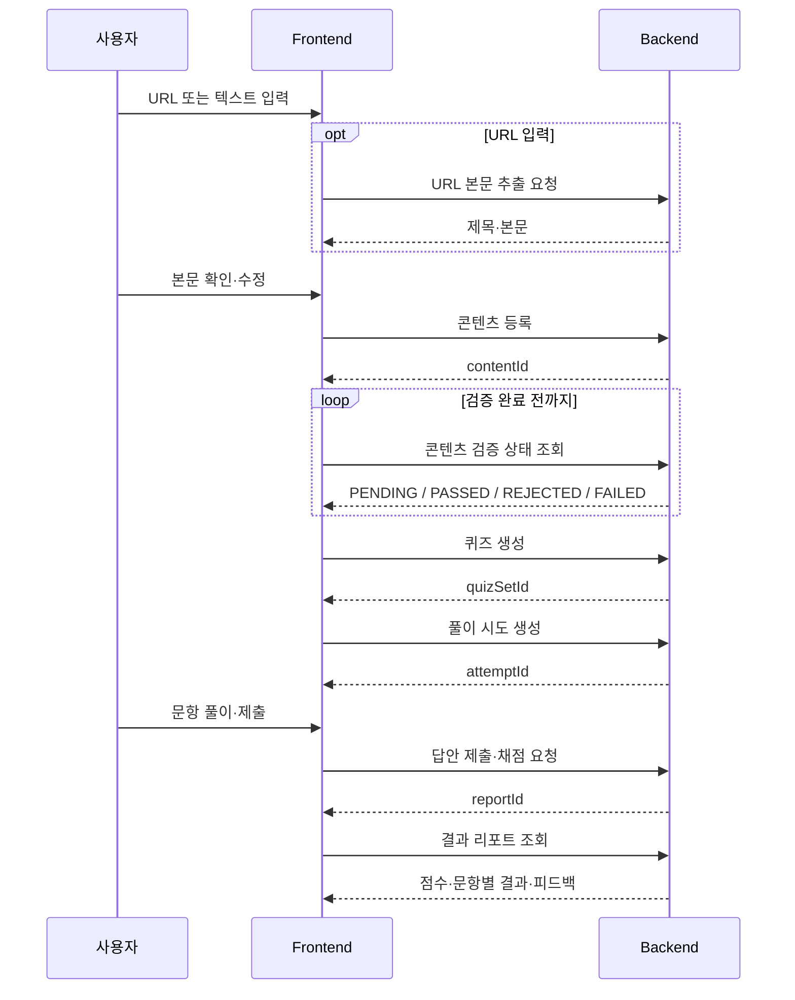
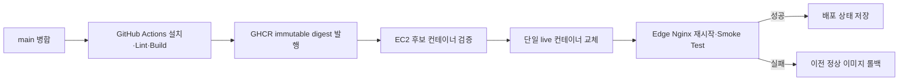

# Readle 프론트엔드

<p align="center">
  
</p>

<p align="center">
  <strong>읽었다를 이해했다로</strong><br />
  기술 아티클을 AI 퀴즈와 피드백으로 바꾸는 개발자용 액티브 러닝 플랫폼
</p>

<p align="center">
  <a href="https://react.dev/"></a>
  <a href="https://www.typescriptlang.org/"></a>
  <a href="https://vite.dev/"></a>
  <a href="https://reactrouter.com/"></a>
  <a href="https://tanstack.com/query/latest"></a>
  <a href="https://tailwindcss.com/"></a>
  <a href="https://mswjs.io/"></a>
  <a href="https://vitest.dev/"></a>
  <a href="https://nginx.org/"></a>
  <a href="https://podman.io/"></a>
  <a href="https://github.com/features/actions"></a>
</p>

## 서비스 소개

Readle은 개발 기술 아티클을 읽은 뒤 핵심 내용을 스스로 설명하고 적용해 보도록 돕는 학습 서비스입니다. URL 또는 텍스트로 콘텐츠를 등록하면 적합성 검증과 AI 퀴즈 생성 과정을 거쳐 퀴즈를 풀 수 있으며, 채점 결과와 학습 기록을 결과 리포트·대시보드·히스토리에서 확인할 수 있습니다.

- **서비스:** [https://app.readle.kro.kr/](https://app.readle.kro.kr/)
- **백엔드 저장소:** [INT2-Readle-Team02-BE](https://github.com/Programmers-Intern-Program/INT2-Readle-Team02-BE)

## 주요 기능

### 콘텐츠 입력 및 검증

- 기술 아티클 URL의 제목과 본문을 불러오거나 텍스트를 직접 입력할 수 있습니다.
- 추출된 본문을 확인·수정하고, 콘텐츠 검증 상태와 실패 사유를 안내합니다.
- 검증 실패 시 재시도 또는 허용된 우회 생성 흐름을 제공합니다.

### AI 퀴즈 생성 및 풀이

- 검증된 콘텐츠를 기반으로 생성된 객관식·주관식·코드 빈칸 문제를 제공합니다.
- 문제별 답변 상태와 전체 진행 상황을 확인하고, 미응답 문항을 검증한 뒤 제출합니다.
- 콘텐츠 검증 상태를 주기적으로 조회하고, 퀴즈 생성의 로딩·실패·재시도·이탈 상황에 대응합니다.

### 채점 및 결과 리포트

- 답안 제출 이후 채점 진행 상태를 안내하고 완료된 결과 리포트로 연결합니다.
- 정답 수·정답률·풀이 시간과 문항별 제출 답안·정답·AI 피드백을 제공합니다.
- URL로 학습한 경우 결과 리포트에서 원본 아티클을 다시 확인할 수 있습니다.

### 학습 현황 및 히스토리

- 누적 학습 수치, 최근 학습 결과, 태그별 학습 횟수와 평균 정답률을 제공합니다.
- Cursor 기반 무한 조회, 태그 필터와 최신순·오래된순 정렬을 지원합니다.
- 과거 학습 기록에서 해당 회차의 결과 리포트로 다시 이동할 수 있습니다.

### OAuth 인증 및 세션 복원

- Kakao·Google OAuth 로그인을 지원하고 인증이 필요한 경로를 보호합니다.
- Access Token은 메모리에만 보관하고 Refresh Token은 HttpOnly Cookie로 사용합니다.
- 새로고침 시 세션 확인과 Access Token 재발급을 거쳐 로그인 상태를 복원합니다.

## 학습 흐름



## 핵심 처리 흐름

### 인증 부트스트랩과 보호 API 재시도



동시에 여러 보호 API가 401을 반환해도 하나의 재발급 Promise를 공유해 Refresh 요청이 중복되지 않도록 처리합니다. 재발급에 실패하면 메모리의 토큰과 사용자 상태를 제거하고 로그인 화면으로 이동합니다.

### 콘텐츠 입력부터 결과 리포트까지



### CI/CD·프론트엔드 배포



## 기술 스택 및 실행 환경

| 항목 | 현재 값 |
| --- | --- |
| UI | React 19, TypeScript 6 |
| 빌드 | Vite 8 |
| 라우팅 | React Router 8 |
| 서버 상태 | TanStack Query 5 |
| 로컬 UI 상태 | React `useState`, Context |
| 스타일 | Tailwind CSS 4, CSS |
| API Mock | MSW 2 |
| 테스트 | Vitest 4, Testing Library |
| 품질 | ESLint 10, TypeScript build |
| 런타임 | Node.js 24, npm 11 |
| 정적 파일 서버 | Nginx Unprivileged 1.28 |
| CI/CD | GitHub Actions, GHCR immutable digest 배포 |
| 운영 | AWS EC2, rootful Podman, Edge Nginx |

정확한 패키지 버전은 `package.json`과 `package-lock.json`을 기준으로 합니다.

## 프론트엔드 구조

```text
src/
├── app/       # 앱 초기화, 전역 Provider, Layout, Router
├── mocks/     # 개발 전용 MSW handler와 fixture
├── pages/     # URL 단위 페이지와 페이지 전용 api·model·ui
├── widgets/   # 여러 기능과 도메인을 조합한 화면 블록
├── features/  # 사용자 행동 단위 기능
├── entities/  # 도메인 모델과 도메인 UI
└── shared/    # 공통 API client, UI, 설정, 스타일, 유틸리티
```

의존 방향은 다음 순서로만 흐릅니다.

```text
app → pages → widgets → features → entities → shared
```

- 하위 레이어는 상위 레이어를 import하지 않습니다.
- 페이지 전용 코드는 재사용성이 확인되기 전까지 `shared`로 이동하지 않습니다.
- 코드가 없는 레이어는 `.gitkeep`으로 미리 생성하지 않습니다.
- `@/` import alias는 `src/`를 가리킵니다.

세부 원칙은 [`src/README.md`](src/README.md)를 참고합니다.

## 페이지와 라우팅

| 화면 | 경로 | 역할 |
| --- | --- | --- |
| 랜딩·로그인 | `/`, `/login` | 서비스 소개, OAuth 로그인 |
| 콘텐츠 입력 | `/learn` | URL 추출, 텍스트 입력, 본문 확인·수정 |
| 콘텐츠 미리보기 | `/contents/preview` | 후속 확장을 위한 예약 경로 |
| 학습 준비 | `/contents/:contentId/preparing` | 콘텐츠 검증·퀴즈 생성 상태 |
| 퀴즈 풀이 | `/quizzes/:quizId` | 문제 풀이와 답안 제출 |
| 채점 진행 | `/quizzes/attempts/:attemptId/grading` | 답안 제출·채점 진행과 복구 |
| 결과 리포트 | `/result-reports/:reportId` | 점수와 문항별 결과·피드백 |
| 학습 현황 | `/dashboard` | 누적 통계와 태그별 학습 현황 |
| 학습 히스토리 | `/history` | Cursor 기반 학습 기록 조회 |
| 디자인 시스템 | `/design-system` | 개발 환경 전용 공통 UI 확인 |

인증이 필요한 페이지는 `RequireAuth`가 보호합니다. 인증 복원이 끝나기 전에는 로딩 화면을 제공하고, 인증되지 않은 사용자는 현재 경로를 `returnTo`로 보존해 로그인 화면으로 이동합니다.

## 서버 상태와 API 통신

### 상태 관리 기준

- API 응답·로딩·오류·캐시는 TanStack Query로 관리합니다.
- 입력값, 모달, 현재 문항 등 페이지 내부 UI 상태는 `useState`로 관리합니다.
- 사용자 인증 정보와 세션 만료 상태는 `AuthContext`로 공유합니다.
- 별도의 복잡한 전역 클라이언트 상태가 없어 Redux·Zustand는 사용하지 않습니다.

### 공통 API Client

- 모든 API 요청은 상대 경로 `/api`를 사용합니다.
- 보호 요청에는 메모리에 보관한 Access Token을 Bearer Header로 추가합니다.
- API 오류를 `ApiError`로 정규화해 네트워크·인증·서버 오류를 구분합니다.
- 보호 요청의 401 응답에는 Access Token을 한 번 재발급하고 원래 요청을 1회 재시도합니다.
- Refresh Token은 JavaScript에서 접근하지 않고 HttpOnly Cookie로 전송합니다.

### 개발 환경

```text
브라우저
  ├─ 화면 요청 ──────> Vite (localhost:3000)
  └─ /api 요청 ─────> Vite proxy ─────> Spring Boot (localhost:8080)
```

`VITE_USE_MOCK=true`이면 개발 환경에서 MSW가 `/api` 요청을 처리합니다. `false`이면 MSW를 시작하지 않고 Vite Proxy가 요청을 Spring Boot로 전달합니다. 운영 빌드에서는 MSW를 시작하지 않습니다.

### 운영 환경

```text
브라우저 ──> Edge Nginx
               ├─ /     ──> readle-frontend:8080
               └─ /api  ──> Spring Boot Backend
```

프론트엔드 컨테이너의 Nginx는 정적 파일과 SPA fallback을 제공합니다. `/api` 분기는 외부 Edge Nginx가 담당하므로 애플리케이션 코드에 운영 백엔드 주소를 하드코딩하지 않습니다.

## 빠른 시작

### 준비 사항

- Node.js 24 (`.nvmrc`)
- npm 11 (`package.json`의 `engines`)
- 실제 API 연동 시 `http://localhost:8080`에서 실행 중인 Spring Boot 백엔드

```bash
nvm use
npm ci
cp .env.example .env
npm run dev
```

개발 서버는 [http://localhost:3000](http://localhost:3000)에서 실행됩니다. 포트가 이미 사용 중이면 다른 포트로 변경하지 않고 종료됩니다.

### 환경 변수

```env
VITE_USE_MOCK=true
```

- `true`: 개발 환경에서 MSW 사용
- `false`: Vite Proxy를 통해 로컬 백엔드 사용

`VITE_` 환경변수는 브라우저 번들에 포함될 수 있습니다. API Key, 비밀번호, DB 접속 정보, Access Token 등 민감한 값을 프론트엔드 환경변수에 저장하지 않습니다.

### npm 명령어

| 명령어 | 역할 |
| --- | --- |
| `npm ci` | Lockfile 기준 의존성 설치 |
| `npm run dev` | Vite 개발 서버 실행 |
| `npm run lint` | ESLint 정적 검사 |
| `npm run test` | Vitest 단위·컴포넌트 테스트 |
| `npm run build` | TypeScript 검사 및 운영 번들 생성 |
| `npm run preview` | 빌드 결과 로컬 확인 |

## 배포와 운영

`main`에 병합되면 GitHub Actions가 의존성 설치, Lint, Build를 검증한 후 Nginx 기반 프론트엔드 이미지를 GHCR에 발행합니다. 배포 입력은 편의 태그가 아닌 immutable image digest와 전체 Git SHA를 사용합니다.

EC2 배포 스크립트는 다음 순서로 동작합니다.

1. 이미지 digest와 OCI revision 검증
2. 후보 컨테이너 health check 및 내부 `/` 응답 확인
3. 단일 `readle-frontend` 컨테이너 교체
4. Edge Nginx 재시작 및 `http://127.0.0.1/` Smoke Test
5. 실패 시 이전 정상 이미지로 롤백

프론트엔드 컨테이너는 `readle-public` 네트워크에만 연결되며 Host Port를 노출하지 않습니다. 후보 검증 후 단일 live 컨테이너를 교체하므로 짧은 중단 시간이 발생할 수 있습니다.

자세한 설치·배포·롤백 절차는 [`ops/frontend/README.md`](ops/frontend/README.md)를 참고합니다.

### 로컬 이미지 확인

```bash
docker build -t readle-frontend .
docker run --rm -p 3000:8080 readle-frontend
```

위 명령은 배포 이미지의 로컬 확인용이며 EC2 배포를 수행하지 않습니다.

## 팀 역할 및 주요 기여

### 👨‍💻 전성 — 프론트엔드·학습 현황

사용자 학습 흐름의 화면 경험과 학습 현황 조회 기능을 구축했습니다.

| 영역 | 내용 |
| --- | --- |
| 공통 UI | 디자인 시스템, 공통 레이아웃·라우팅, 랜딩·소셜 로그인 UI 구현 |
| 학습 흐름 | 콘텐츠 입력, 퀴즈 풀이·채점·결과 리포트 화면과 API 연동 구현 |
| 학습 현황 | 대시보드·학습 히스토리 UI, Cursor 페이지네이션·모바일·접근성 개선 |
| 백엔드 | 자동 태깅, 대시보드 집계, 학습 히스토리·결과 리포트 API 구현 |

### 👩‍💻 김세희 — 콘텐츠 검증·AI 안정화

콘텐츠 수집·검증 파이프라인과 AI 호출의 안정성을 강화했습니다.

| 영역 | 내용 |
| --- | --- |
| 콘텐츠 검증 | URL 크롤링, 정적 가드레일·화이트리스트·AI 적합성 검증, 검증 재시도 구현 |
| 안정성·보안 | 프롬프트 인젝션 방어, 비관적 락 기반 동시성 제어, 크롤링 노이즈·예외 처리 개선 |
| AI 연동 | Claude 템플릿 공통화, 스키마 재시도·타임아웃·인터럽트 처리 보완 |
| 프론트 파이프라인 | 콘텐츠 검증·퀴즈 생성 상태 Polling, 입력 복원, 실패·재시도 UX 구현 |

### 👨‍💻 서일현 — 인증·인프라·운영

OAuth/JWT 기반 인증과 EC2 운영 자동화·관측 환경을 구축했습니다.

| 영역 | 내용 |
| --- | --- |
| 인증·보안 | Kakao·Google OAuth, PKCE, JWT Access Token, Refresh Token·Cookie, Security 경계 구현 |
| 배포 자동화 | Podman 배포·롤백, GHCR digest 기반 CI/CD, Nginx 연결 구성 |
| 운영 안정성 | MySQL S3 백업, 런타임 검증·복구 경로, Prometheus·Grafana·Loki·Alloy 관측 환경 구축 |
| 프론트 연동 | 인증 상태·보호 라우트·세션 만료 UX 연동 |

### 👨‍💻 장성재 — 퀴즈·AI 채점

퀴즈 생성부터 답안 제출·AI 채점·결과 복구까지의 핵심 학습 도메인을 구현했습니다.

| 영역 | 내용 |
| --- | --- |
| 퀴즈 생성 | 생성·재생성 흐름, 동시 요청 제어, 품질 가드레일과 실패 복구 처리 구현 |
| 풀이·채점 | 답안 제출, AI 채점, 결과 리포트 계약과 상태 전이·롤백 처리 안정화 |
| AI 견고성 | 프롬프트 인젝션·JSON 파싱 방어, 타임아웃·예외 처리, 응답 품질 보완 |
| 프론트 연동 | 퀴즈 API 연동, 제출 경쟁 조건 방어, 사용자 오류 안내 UX 구현 |

## 관련 문서

- [프론트엔드 레이어 및 의존 방향](src/README.md)
- [공통 UI 사용 가이드](src/shared/ui/README.md)
- [프론트엔드 배포·롤백](ops/frontend/README.md)
- [백엔드 API 설계](https://github.com/Programmers-Intern-Program/INT2-Readle-Team02-BE/blob/main/docs/design/API.md)
- [인증 설계](https://github.com/Programmers-Intern-Program/INT2-Readle-Team02-BE/blob/main/docs/design/AUTH_DESIGN.md)
- [AI 설계](https://github.com/Programmers-Intern-Program/INT2-Readle-Team02-BE/blob/main/docs/design/AI_DESIGN.md)
- [ERD](https://github.com/Programmers-Intern-Program/INT2-Readle-Team02-BE/blob/main/docs/design/ERD.md)
